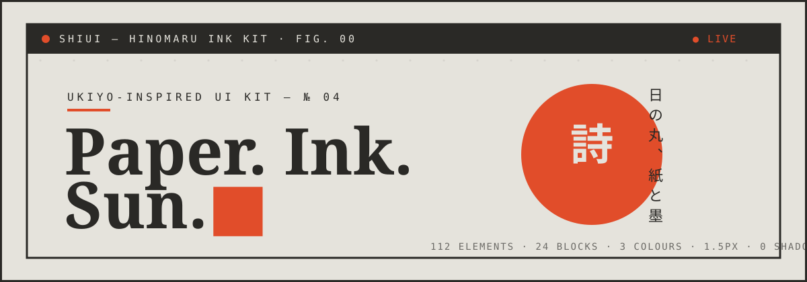
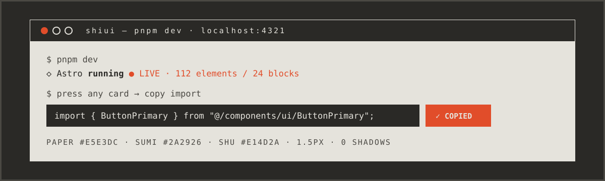
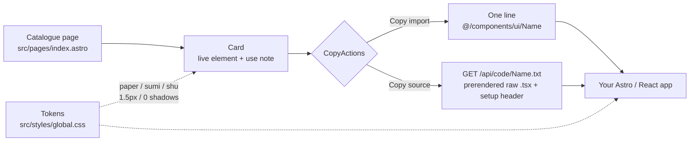

<picture>
  <source media="(prefers-color-scheme: dark)" srcset="./assets/hero-dark.svg">
  <source media="(prefers-color-scheme: light)" srcset="./assets/hero-light.svg">
  
</picture>

<h1 align="center">SHIUI 詩 — Hinomaru Ink UI Kit</h1>

<p align="center"><b>A flat poster-system for interfaces: paper, sumi ink, one vermilion sun. 112 live React elements + 24 Astro blocks. 1.5px lines. Zero shadows.</b></p>

<p align="center">
  <a href="./package.json"></a>
  <a href="./package.json"></a>
  <a href="./package.json"></a>
  <a href="./biome.json"></a>
  <a href="./package.json"></a>
  <a href="./package.json"></a>
</p>

<p align="center">
  <a href="#quick-start"><b>Get the kit →</b></a> ·
  <a href="#the-flex">The system</a> ·
  <a href="#catalogue">Catalogue</a> ·
  <a href="#tokens">Tokens</a> ·
  <a href="#how-it-works">How it works</a>
</p>

---

## The flex



| | | |
|---|---|---|
| **112** | **24** | **3** |
| Live React elements in `src/components/ui/` — every one rendered on the page, every one pressable | Ready Astro blocks in `src/components/blocks/` — hero, pricing, auth, dashboard, timeline, footer | Colours. Paper `#e5e3dc`, sumi `#2a2926`, shu `#e14d2a`. Nothing else carries meaning |

> [!TIP]
> Every card on the catalogue page ships two buttons: **Copy import** (one line) and **Copy source** (full self-contained `.tsx` with a setup header served from `/api/code/[name].txt`). Try it on the card, then paste.

> [!NOTE]
> No shadows, no rounded rectangles, no gradients-as-crutch. Borders do the talking: `1.5px`, always ink or vermilion. Only the sun and the seals stay round (`.rounded-full`).

---

## Quick start

```bash
pnpm install
pnpm dev      # catalogue at http://localhost:4321
```

```bash
pnpm build    # astro build → dist/
pnpm preview  # serve the production catalogue locally
```

Use any element in your own Astro + React + Tailwind v4 project:

```tsx
import { ButtonPrimary } from "@/components/ui/ButtonPrimary";

export default function Order() {
  return <ButtonPrimary>Reserve a seat</ButtonPrimary>;
}
```

Need the file, not the package? Each card's **Copy source** hits a prerendered text endpoint:

```bash
curl http://localhost:4321/api/code/ButtonPrimary.txt
```

```tsx
/**
 * ButtonPrimary — SHIUI Hinomaru ink kit. Self-contained: only "react" is imported.
 * SHIUI setup (Tailwind v4) — tokens: --color-paper #e5e3dc, --color-sumi #2a2926, --color-shu #e14d2a ...
 */
```

---

## Why ShiUI

<table border="0">
  <tr>
    <td width="50%" valign="top">
      <h3>■ One strict poster system</h3>
      <p>Three colours, three type voices (Shippori Mincho display / Zen Kaku Gothic body / IBM Plex Mono labels), one line weight. Cards, forms, charts, dialogs — all drawn with the same brush, so any page looks issued, not assembled.</p>
    </td>
    <td width="50%" valign="top">
      <h3>● Live before docs</h3>
      <p>The catalogue <i>is</i> the test suite: press the split button, flip the switch, dismiss the toast, step the quantity. If it works on the card, it works in your layout. No dead screenshots.</p>
    </td>
  </tr>
  <tr>
    <td width="50%" valign="top">
      <h3>◆ Copy-paste without lock-in</h3>
      <p>No component library to install, no theme provider to mount. Each <code>.tsx</code> imports only <code>react</code> plus Tailwind tokens. Take one button or all 112 files — the kit never phones home.</p>
    </td>
    <td width="50%" valign="top">
      <h3>▲ Blocks that close the page</h3>
      <p>24 Astro sections cover the full landing arc — <code>HeroHinomaru</code>, <code>FeatureGrid</code>, <code>PricingTable</code>, <code>TestimonialWall</code>, <code>AuthCard</code>, <code>DashboardPanel</code>, <code>FooterInk</code>. Compose a complete page in an afternoon.</p>
    </td>
  </tr>
</table>

---

## How it works



`src/pages/api/code/[name].txt.ts` globs `src/components/ui/*.tsx` as raw text at build time, prepends the token/setup header (including which `global.css` helpers the file uses: `ink-wipe`, `link-brush`, `vertical-rl`, …), and serves one plain-text file per component. Static output, no server needed.

---

## Catalogue

### Elements — `src/components/ui/` (112, via `src/components/ui/index.ts`)

| Section | Elements |
|---|---|
| Actions | `ButtonPrimary` `ButtonSecondary` `ButtonOutline` `ButtonGhost` `ButtonInk` `ButtonDestructive` `ButtonSmall` `ButtonLarge` `ButtonWithArrow` `ButtonLoading` `IconButton` `SplitButton` `CloseButton` `ToggleButton` |
| Seals, tags, eyebrows | `HankoSeal` `HankoRound` `NumeralSeal` `PriceStamp` `BadgeCount` `BadgeDot` `TagChip` `TagOutline` `KickerLabel` `StatusPill` `LiveDot` |
| Forms | `TextInput` `TextareaInput` `PasswordInput` `SearchInput` `SelectInput` `DateInput` `FileInput` `OtpInput` `InputAddon` `InputIcon` `FormLabel` `FieldHint` `FieldError` `CheckboxInk` `CheckboxCard` `RadioInk` `SwitchInk` `RangeSlider` `QuantityStepper` `RatingStars` |
| Navigation | `LinkArrow` `LinkUnderline` `BreadcrumbTrail` `TabsBoxed` `TabsUnderline` `PaginationInk` `PageDots` `StepsBar` `MenuList` `SidebarItem` `SectionRail` `BackToTop` |
| Feedback | `AlertNote` `AlertVermilion` `InlineBanner` `NoticeCard` `ToastInk` `EmptyState` `SkeletonLines` `SpinnerEnso` `ProgressBar` `ProgressRing` `ConfirmStrip` `CookieStrip` |
| Overlays | `ModalDialog` `DialogConfirm` `DrawerPanel` `DropdownMenu` `PopoverNote` `TooltipBubble` `HoverCard` `FilterSheet` `CommandRow` |
| Data | `DataTable` `DefinitionList` `InfoRow` `ListRow` `StatCard` `KpiDelta` `ChartBars` `ChartTrend` `ChartDonut` `ChartWaffle` `TimelineRail` |
| Commerce & content | `CardInk` `FeatureCell` `PricingCell` `CouponEdge` `TicketStub` `QuoteCard` `TestimonialMini` `CalloutKanji` `AvatarCircle` `AvatarHanko` `NewsletterRow` `CodeBlock` |
| Brand & utility | `LogoMark` `IconSun` `IconTorii` `IconWave` `DividerLine` `DividerSun` `MarqueeStrip` `TokenSwatch` `CopyButton` `CopyActions` |

### Blocks — `src/components/blocks/` (24)

`HeroHinomaru` `MarqueeBand` `FeatureGrid` `StatsBand` `GalleryStrip` `TypeSpecimen` `PricingTable` `TestimonialWall` `TimelineSection` `TableSection` `StepsWizard` `DashboardPanel` `TrendReport` `NoticeStack` `FaqBlock` `AuthCard` `ContactForm` `NewsletterPanel` `SharePanel` `CartRow` `ProfileCard` `CtaBanner` `SealWall` `FooterInk`

<details>
<summary><b>Full element index (112 exports, copy-paste ready)</b></summary>

```ts
export { AccordionInk } from "./AccordionInk";
export { AlertNote } from "./AlertNote";
export { AlertVermilion } from "./AlertVermilion";
export { AvatarCircle } from "./AvatarCircle";
export { AvatarHanko } from "./AvatarHanko";
export { BackToTop } from "./BackToTop";
export { BadgeCount } from "./BadgeCount";
export { BadgeDot } from "./BadgeDot";
export { BreadcrumbTrail } from "./BreadcrumbTrail";
export { ButtonDestructive } from "./ButtonDestructive";
export { ButtonGhost } from "./ButtonGhost";
export { ButtonInk } from "./ButtonInk";
export { ButtonLarge } from "./ButtonLarge";
export { ButtonLoading } from "./ButtonLoading";
export { ButtonOutline } from "./ButtonOutline";
export { ButtonPrimary } from "./ButtonPrimary";
export { ButtonSecondary } from "./ButtonSecondary";
export { ButtonSmall } from "./ButtonSmall";
export { ButtonWithArrow } from "./ButtonWithArrow";
export { CalloutKanji } from "./CalloutKanji";
export { CardInk } from "./CardInk";
export { ChartBars } from "./ChartBars";
export { ChartDonut } from "./ChartDonut";
export { ChartTrend } from "./ChartTrend";
export { ChartWaffle } from "./ChartWaffle";
export { CheckboxCard } from "./CheckboxCard";
export { CheckboxInk } from "./CheckboxInk";
export { CloseButton } from "./CloseButton";
export { CodeBlock } from "./CodeBlock";
export { CommandRow } from "./CommandRow";
export { ConfirmStrip } from "./ConfirmStrip";
export { CookieStrip } from "./CookieStrip";
export { CopyActions } from "./CopyActions";
export { CopyButton } from "./CopyButton";
export { CouponEdge } from "./CouponEdge";
export { DataTable } from "./DataTable";
export { DateInput } from "./DateInput";
export { DefinitionList } from "./DefinitionList";
export { DialogConfirm } from "./DialogConfirm";
export { DividerLine } from "./DividerLine";
export { DividerSun } from "./DividerSun";
export { DrawerPanel } from "./DrawerPanel";
export { DropdownMenu } from "./DropdownMenu";
export { EmptyState } from "./EmptyState";
export { FeatureCell } from "./FeatureCell";
export { FieldError } from "./FieldError";
export { FieldHint } from "./FieldHint";
export { FileInput } from "./FileInput";
export { FilterSheet } from "./FilterSheet";
export { FormLabel } from "./FormLabel";
export { HankoRound } from "./HankoRound";
export { HankoSeal } from "./HankoSeal";
export { HoverCard } from "./HoverCard";
export { IconButton } from "./IconButton";
export { IconSun } from "./IconSun";
export { IconTorii } from "./IconTorii";
export { IconWave } from "./IconWave";
export { InfoRow } from "./InfoRow";
export { InlineBanner } from "./InlineBanner";
export { InputAddon } from "./InputAddon";
export { InputIcon } from "./InputIcon";
export { KickerLabel } from "./KickerLabel";
export { KpiDelta } from "./KpiDelta";
export { LinkArrow } from "./LinkArrow";
export { LinkUnderline } from "./LinkUnderline";
export { ListRow } from "./ListRow";
export { LiveDot } from "./LiveDot";
export { LogoMark } from "./LogoMark";
export { MarqueeStrip } from "./MarqueeStrip";
export { MenuList } from "./MenuList";
export { ModalDialog } from "./ModalDialog";
export { NewsletterRow } from "./NewsletterRow";
export { NoticeCard } from "./NoticeCard";
export { NumeralSeal } from "./NumeralSeal";
export { OtpInput } from "./OtpInput";
export { PageDots } from "./PageDots";
export { PaginationInk } from "./PaginationInk";
export { PasswordInput } from "./PasswordInput";
export { PopoverNote } from "./PopoverNote";
export { PriceStamp } from "./PriceStamp";
export { PricingCell } from "./PricingCell";
export { ProgressBar } from "./ProgressBar";
export { ProgressRing } from "./ProgressRing";
export { QuantityStepper } from "./QuantityStepper";
export { QuoteCard } from "./QuoteCard";
export { RadioInk } from "./RadioInk";
export { RangeSlider } from "./RangeSlider";
export { RatingStars } from "./RatingStars";
export { SearchInput } from "./SearchInput";
export { SectionRail } from "./SectionRail";
export { SelectInput } from "./SelectInput";
export { SidebarItem } from "./SidebarItem";
export { SkeletonLines } from "./SkeletonLines";
export { SpinnerEnso } from "./SpinnerEnso";
export { SplitButton } from "./SplitButton";
export { StatCard } from "./StatCard";
export { StatusPill } from "./StatusPill";
export { StepsBar } from "./StepsBar";
export { SwitchInk } from "./SwitchInk";
export { TabsBoxed } from "./TabsBoxed";
export { TabsUnderline } from "./TabsUnderline";
export { TagChip } from "./TagChip";
export { TagOutline } from "./TagOutline";
export { TestimonialMini } from "./TestimonialMini";
export { TextareaInput } from "./TextareaInput";
export { TextInput } from "./TextInput";
export { TicketStub } from "./TicketStub";
export { TimelineRail } from "./TimelineRail";
export { ToastInk } from "./ToastInk";
export { ToggleButton } from "./ToggleButton";
export { TokenSwatch } from "./TokenSwatch";
export { TooltipBubble } from "./TooltipBubble";
```

</details>

---

## Tokens

| Token | Value | Role |
|---|---|---|
| `paper` | `#e5e3dc` | Every surface. Breathe first, ink second |
| `paper-deep` | `#d9d6cc` | Recessed panels, sun backdrop |
| `sumi` | `#2a2926` | Every border and body word. 1.5px, never shadow |
| `sumi-soft` | `#4a4843` | Secondary labels, hairlines |
| `shu` | `#e14d2a` | Sun, seal, signal — spent sparingly |
| `shu-deep` | `#b93a1e` | Destructive fills, pressed states |

| Voice | Font | Used for |
|---|---|---|
| Display | `Shippori Mincho B1` | Headlines, numerals, seals |
| Body | `Zen Kaku Gothic New` | Paragraphs, buttons, inputs |
| Mono | `IBM Plex Mono` | Eyebrows, № plates, code |

Minimum to reuse the look in any Tailwind v4 project (`src/styles/global.css`):

```css
@import "tailwindcss";

@theme {
  --color-paper: #e5e3dc;
  --color-paper-deep: #d9d6cc;
  --color-sumi: #2a2926;
  --color-sumi-soft: #4a4843;
  --color-shu: #e14d2a;
  --color-shu-deep: #b93a1e;
}
```

Rules that keep the poster honest:

```css
* { border-radius: 0 !important; }          /* sharp poster corners everywhere */
.rounded-full { border-radius: 9999px !important; }  /* …except sun and seals */
.paper-grain { background-image: radial-gradient(rgba(42,41,38,.055) 1px, transparent 1px); background-size: 22px 22px; }
.ink-frame { border: 1.5px solid var(--color-sumi); }
.ink-wipe { position: relative; isolation: isolate; overflow: hidden; }  /* hover fill wipe */
.link-brush { background-size: 0% 1.5px; }  /* animated underline */
.vertical-rl { writing-mode: vertical-rl; }                       /* 日の丸 margins */
```

<details>
<summary><b>Full setup contract (what a pasted component expects)</b></summary>

1. Tailwind v4 with the six `@theme` colour tokens above.
2. The three font families loaded (see `src/styles/global.css` `@import`: Shippori Mincho B1, Zen Kaku Gothic New, IBM Plex Mono).
3. `global.css` helpers if the copied source mentions them — the `/api/code/*.txt` header names them per file (`ink-wipe`, `link-brush`, `vertical-rl`, `ink-range`, `enso-spin`, `stamp-in`, `animate-marquee`).
4. React 19 for interactive elements; static ones (seals, dividers, kickers) render without state.

</details>

---

## Project structure

```
ShiUI/
├── assets/                     # README artwork (hero-dark/light, terminal)
├── public/favicon.svg          # the sun — one vermilion circle
├── src/
│   ├── components/ui/          # 112 React elements (.tsx) + index.ts barrel
│   ├── components/blocks/      # 24 Astro sections (.astro)
│   ├── layouts/Layout.astro    # paper-grain body, fonts, meta
│   ├── pages/index.astro       # the live catalogue
│   ├── pages/api/code/[name].txt.ts  # prerendered Copy-source endpoint
│   ├── styles/global.css       # tokens, wipe/brush/marquee/enso keyframes
│   └── types/raw.d.ts
├── astro.config.mjs            # astro + react + tailwindcss, @ → ./src
├── biome.json                  # lint + format (space, 120 col, double quotes)
└── package.json                # pnpm 11 · astro 7 · react 19 · tailwind v4
```

> [!IMPORTANT]
> Requires `pnpm` (see `devEngines` in `package.json`) and Node with React 19. No other runtime dependencies — `@vercel/analytics` is injected on the catalogue page only.

---

## Before / after

| Without ShiUI | With ShiUI |
|---|---|
| Five greys, three radii, two shadow scales to tune per card | `paper / sumi / shu` + `1.5px` + `0` — decisions already made |
| Docs screenshots that rot on the next prop change | Catalogue cards are the running components |
| `npm i yet-another-kit` + theme provider + version pin anxiety | Copy one `.tsx` — it imports only `react` |

---

## Scripts

| Command | What it does |
|---|---|
| `pnpm install` | Install workspace dependencies |
| `pnpm dev` | `astro dev` — live catalogue with hot reload |
| `pnpm build` | `astro build` — static site + prerendered `/api/code/*.txt` |
| `pnpm preview` | `astro preview` — serve `dist/` locally |

> [!WARNING]
> Catalogue copy counts drift as the kit grows: the page header, hero blocks, and this README each state the totals. After adding an element, update all three (or open an issue — stale numbers are a bug).

---

## License

ISC. Take the files, ship the poster.

<p align="center"><b>紙 · 墨 · 日 — paper holds, ink decides, sun signs.</b></p>
